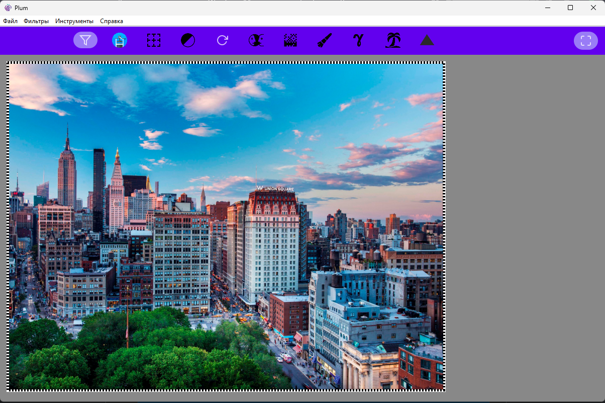
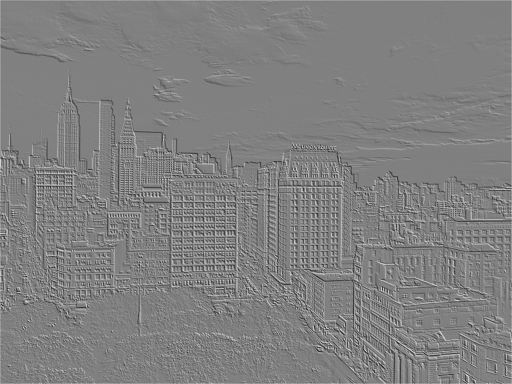

# Plum

  

## Описание 

Desktop приложение для обработки изображений(jpg,png,bitmap)

## Фичи-лист 

- Сгалживающий фильтр 
- Тиснение 
- Выделение границ 
  - Алгоритм Собеля 
  - Алгоритм Роберта
- Черно-белый фильтр
- Поворот 
- Отображение
  - Горизонтальное
  - Вертикальное
- Дизеринг
  - Флойд-Стейнберг
  - Упорядоченнный
- Аквариализация 
- Гамма-коррекция 
- Валенсия 
- Резкость 
- Интерполяция 
- Открытие 
- Сохранение 

## Интерфейс 

## Примеры обработки

### Начальное изображение 

### Тиснение 

### Дизеринг

### Аквариализация
